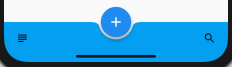
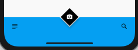
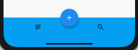
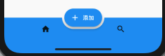
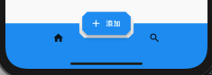
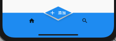

# flutter_demo

Flutter Demo Project.

## BottomAppBar Demo List

#### Demo One



---

#### Demo Two



参考自：https://github.com/flutter/flutter/issues/21650

---

#### Demo Three



---

#### Demo Four

椭圆形：



```
Scaffold(
        bottomNavigationBar: BottomAppBar(
         shape: AutomaticNotchedShape(
          RoundedRectangleBorder(),
          StadiumBorder(side: BorderSide()), // 主要是这行代码
        ),
          ...
        floatingActionButton: FloatingActionButton.extended(
        onPressed: () {},
        icon: Icon(Icons.add),
        label: Text('添加'),
        ),
        ...
      )
```

多边形：



```
Scaffold(
        bottomNavigationBar: BottomAppBar(
          shape: AutomaticNotchedShape(
          RoundedRectangleBorder(),
          BeveledRectangleBorder(
              borderRadius: BorderRadius.circular(10)), // 设置多边形形状
        ),
          ...
        floatingActionButton: FloatingActionButton.extended(
         onPressed: () {},
        icon: Icon(Icons.add),
        label: Text('添加'),
        shape: BeveledRectangleBorder(
            borderRadius: BorderRadius.circular(10)), // 设置多边形形状
        ),
        ...
      )
```

菱形：



```
Scaffold(
        bottomNavigationBar: BottomAppBar(
          shape: AutomaticNotchedShape(
          RoundedRectangleBorder(),
          BeveledRectangleBorder(
              borderRadius: BorderRadius.circular(100)),
        ),
          ...
        floatingActionButton: FloatingActionButton.extended(
         onPressed: () {},
        icon: Icon(Icons.add),
        label: Text('添加'),
        shape: BeveledRectangleBorder(
            borderRadius: BorderRadius.circular(100)),
        ),
        ...
      )
```

参考自：[BottomAppBar | Flutter | 老孟](http://laomengit.com/flutter/widgets/BottomAppBar.html)

---