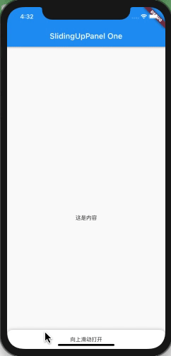
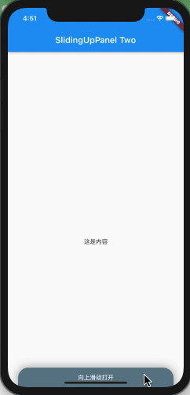
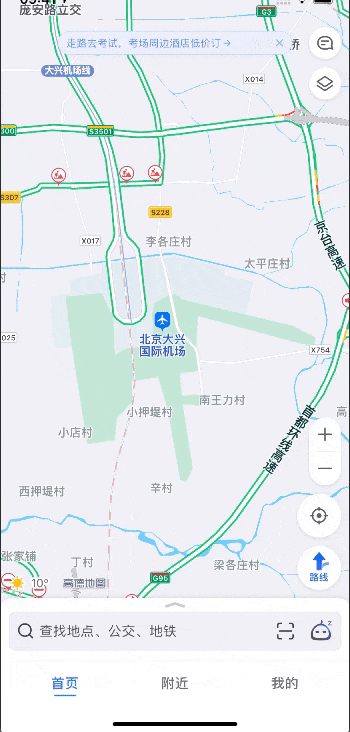
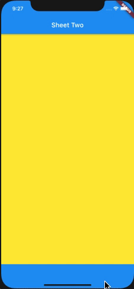

# flutter_demo

底部弹层效果

## Demo List

### sliding_up_panel

* https://pub.dev/packages/sliding_up_panel

```
sliding_up_panel: ^1.0.2
```

#### Panel One



```
    Scaffold(
      appBar: AppBar(
        title: Text('SlidingUpPanel One'),
      ),
      body: SlidingUpPanel(
        panel: Center(
          child: Text('这是浮层控件'),
        ),
        body: Center(
          child: Text('这是内容'),
        ),
        backdropEnabled: true, // 是否显示阴影遮罩层
        // backdropTapClosesPanel: false, // 是否支持点击遮罩层关闭浮层
        // backdropColor: Colors.red, // 遮罩层颜色
        // backdropOpacity: 0.3, //遮罩层透明度
        minHeight: 50, // 完全折叠时滑动面板的高度
        // maxHeight: 1000, // 完全打开时滑动面板的高度
        // isDraggable: false, // 是否能够上下拖动面板
        parallaxEnabled: true, // 视差滚动
        parallaxOffset: 0.2, // 视差滚动阈值
        borderRadius: BorderRadius.only(
          topLeft: Radius.circular(14),
          topRight: Radius.circular(14),
        ), //为浮层添加圆角效果
        collapsed: Container(
          child: Center(
            child: Text('向上滑动打开'),
          ),
        ), // 显示在浮层顶部的一个提示性文字区域，随浮层展开而淡出
      ),
    );
```

#### Panel Two

带有浮动效果的浮层



```
    Scaffold(
      appBar: AppBar(
        title: Text('SlidingUpPanel Two'),
      ),
      body: SlidingUpPanel(
        backdropEnabled: true, // 是否显示阴影遮罩层
        // backdropTapClosesPanel: false, // 是否支持点击遮罩层关闭浮层
        // backdropColor: Colors.red, // 遮罩层颜色
        // backdropOpacity: 0.3, //遮罩层透明度
        minHeight: 70, // 完全折叠时滑动面板的高度
        // maxHeight: 1000, // 完全打开时滑动面板的高度
        // isDraggable: false, // 是否能够上下拖动面板
        parallaxEnabled: true, // 视差滚动
        parallaxOffset: 0.2, // 视差滚动阈值
        borderRadius: BorderRadius.only(
          topLeft: Radius.circular(14),
          topRight: Radius.circular(14),
        ), //为浮层添加圆角效果
        collapsed: Container(
          decoration: BoxDecoration(
            color: Colors.blueGrey,
            borderRadius: BorderRadius.only(
                topLeft: Radius.circular(24.0),
                topRight: Radius.circular(24.0)),
          ),
          margin: const EdgeInsets.fromLTRB(24.0, 24.0, 24.0, 0.0),
          child: Center(
            child: Text('向上滑动打开', style: TextStyle(color: Colors.white)),
          ),
        ), // 显示在浮层顶部的一个提示性文字区域，随浮层展开而淡出
        renderPanelSheet: false, // 启用浮动效果
        panel: Container(
          decoration: BoxDecoration(
              color: Colors.white,
              borderRadius: BorderRadius.all(Radius.circular(24.0)),
              boxShadow: [
                BoxShadow(blurRadius: 20.0, color: Colors.grey),
              ]),
          margin: const EdgeInsets.all(24.0),
          child: Center(child: Text('这是浮层')),
        ),
        body: Center(child: Text('这是内容')),
      ),
    );
```

---

### modal_bottom_sheet

* https://pub.dev/packages/modal_bottom_sheet
* [Flutter Modal Bottom Sheets](https://jamesblasco.github.io/modal_bottom_sheet/#/)

```
modal_bottom_sheet: ^0.2.2
```

引入失败，无法实现预期效果。待后期完善。

#### Sheet One


```

```

#### Sheet Two


```

```

---

### snapping_sheet

* https://pub.dev/packages/snapping_sheet
* https://github.com/AdamJonsson/snapping_sheet

```
snapping_sheet: ^2.0.1
```

#### Sheet Two

实现仿高德首页底部弹层滑动效果




插件实现效果：




```
    Scaffold(
      appBar: AppBar(
        title: Text('Sheet Two'),
      ),
      body: SnappingSheet(
        child: Container(
          color: Colors.yellow,
        ),
        sheetBelow: SnappingSheetContent(
          child: Container(
            color: Colors.red,
          ),
          heightBehavior: SnappingSheetHeight.fit(),
        ),
        grabbing: Container(
          color: Colors.blue,
        ),
      ),
    );
```

---

